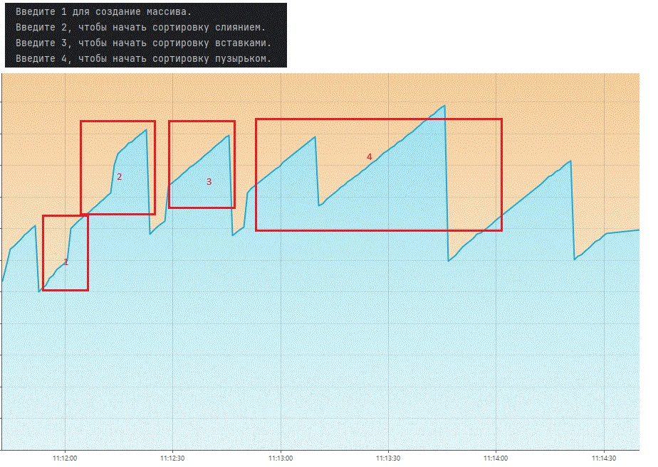
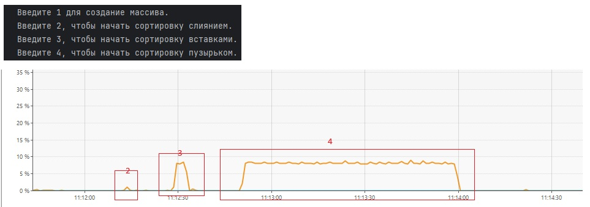
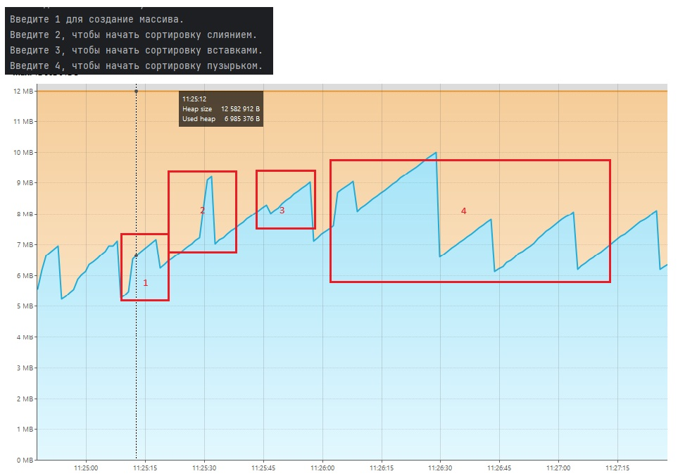
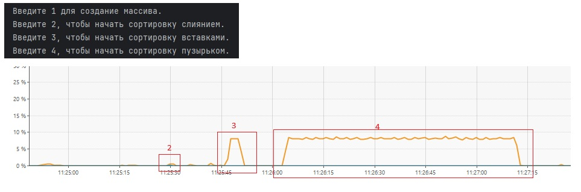
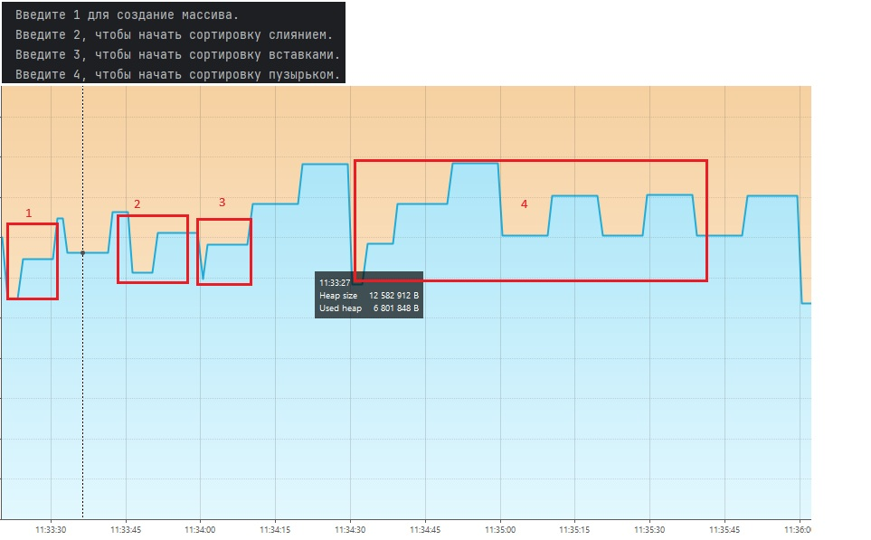
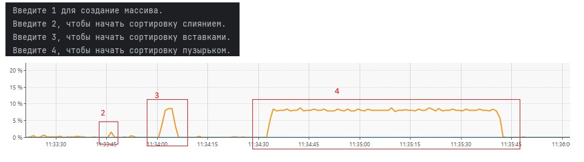
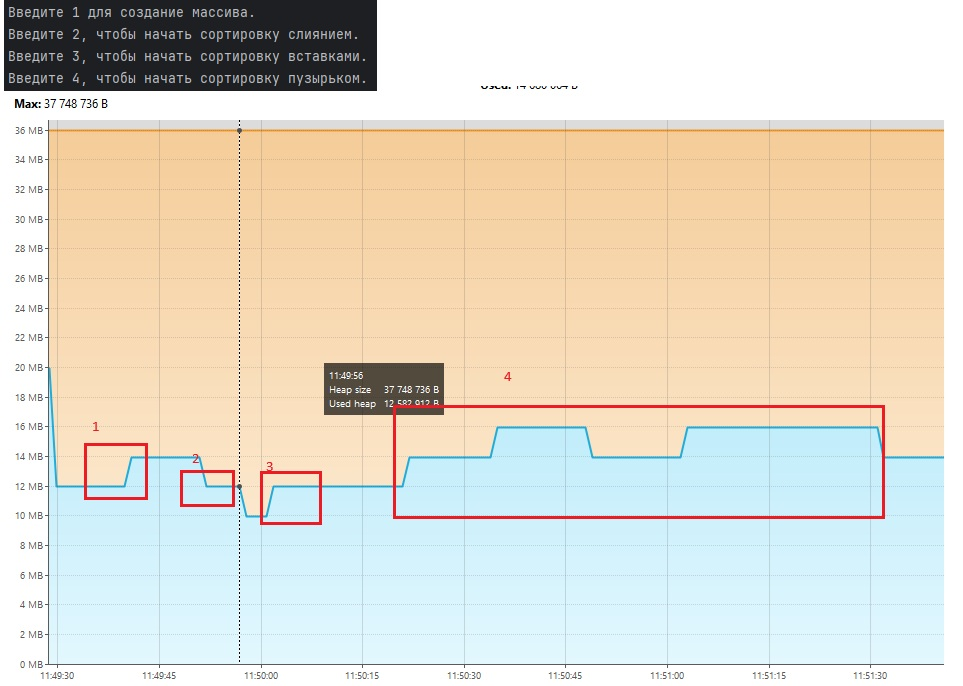
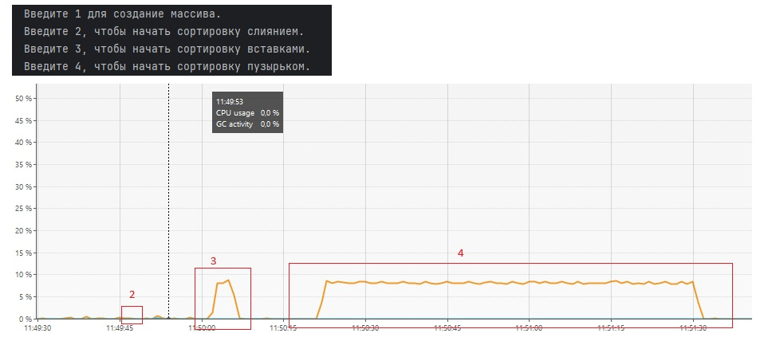

**1. Запуск программы с использованием Serial:**

   
   
```
[2025-03-08T11:11:36.843+0500][info][gc] Using Serial
[2025-03-08T11:11:42.040+0500][info][gc] GC(0) Pause Young (Allocation Failure) 3M->1M(11M) 2.839ms
[2025-03-08T11:11:42.114+0500][info][gc] GC(1) Pause Young (Allocation Failure) 4M->2M(11M) 3.054ms
[2025-03-08T11:11:42.197+0500][info][gc] GC(2) Pause Young (Allocation Failure) 5M->2M(11M) 2.898ms
[2025-03-08T11:11:42.232+0500][info][gc] GC(3) Pause Young (Allocation Failure) 6M->4M(11M) 2.705ms
[2025-03-08T11:11:42.255+0500][info][gc] GC(4) Pause Young (Allocation Failure) 7M->5M(11M) 2.805ms
[2025-03-08T11:11:42.397+0500][info][gc] GC(5) Pause Young (Allocation Failure) 8M->6M(11M) 2.678ms
[2025-03-08T11:11:42.493+0500][info][gc] GC(6) Pause Young (Allocation Failure) 9M->6M(11M) 1.852ms
[2025-03-08T11:11:42.580+0500][info][gc] GC(7) Pause Young (Allocation Failure) 9M->9M(11M) 0.026ms
[2025-03-08T11:11:42.593+0500][info][gc] GC(8) Pause Full (Allocation Failure) 9M->4M(11M) 11.898ms
[2025-03-08T11:11:52.354+0500][info][gc] GC(9) Pause Full (System.gc()) 7M->4M(11M) 12.765ms
[2025-03-08T11:12:12.643+0500][info][gc] GC(10) Pause Young (Allocation Failure) 8M->5M(11M) 0.767ms
[2025-03-08T11:12:13.023+0500][info][gc] GC(11) Pause Young (Allocation Failure) 9M->6M(11M) 0.667ms
[2025-03-08T11:12:13.027+0500][info][gc] GC(12) Pause Young (Allocation Failure) 10M->10M(11M) 0.056ms
[2025-03-08T11:12:13.039+0500][info][gc] GC(13) Pause Full (Allocation Failure) 10M->6M(11M) 12.228ms
[2025-03-08T11:12:13.043+0500][info][gc] GC(14) Pause Young (Allocation Failure) 9M->6M(11M) 0.441ms
[2025-03-08T11:12:13.046+0500][info][gc] GC(15) Pause Young (Allocation Failure) 10M->6M(11M) 0.188ms
[2025-03-08T11:12:13.049+0500][info][gc] GC(16) Pause Young (Allocation Failure) 10M->10M(11M) 0.025ms
[2025-03-08T11:12:13.059+0500][info][gc] GC(17) Pause Full (Allocation Failure) 10M->6M(11M) 9.469ms
[2025-03-08T11:12:13.062+0500][info][gc] GC(18) Pause Young (Allocation Failure) 9M->6M(11M) 0.180ms
[2025-03-08T11:12:13.065+0500][info][gc] GC(19) Pause Young (Allocation Failure) 9M->6M(11M) 0.183ms
[2025-03-08T11:12:13.067+0500][info][gc] GC(20) Pause Young (Allocation Failure) 10M->6M(11M) 0.180ms
[2025-03-08T11:12:22.651+0500][info][gc] GC(21) Pause Young (Allocation Failure) 10M->6M(11M) 0.656ms
[2025-03-08T11:12:45.668+0500][info][gc] GC(22) Pause Young (Allocation Failure) 10M->6M(11M) 0.518ms
[2025-03-08T11:13:09.687+0500][info][gc] GC(23) Pause Young (Allocation Failure) 9M->7M(11M) 0.786ms
[2025-03-08T11:13:45.708+0500][info][gc] GC(24) Pause Young (Allocation Failure) 10M->10M(11M) 0.033ms
[2025-03-08T11:13:45.719+0500][info][gc] GC(25) Pause Full (Allocation Failure) 10M->5M(11M) 10.499ms
[2025-03-08T11:14:20.729+0500][info][gc] GC(26) Pause Young (Allocation Failure) 9M->5M(11M) 0.421ms
```


**2. Запуск программы с использованием Parallel:**

   
   
```
[2025-03-08T11:24:43.331+0500][info][gc] Using Parallel
[2025-03-08T11:24:47.145+0500][info][gc] GC(0) Pause Young (Allocation Failure) 3M->1M(11M) 1.741ms
[2025-03-08T11:24:47.209+0500][info][gc] GC(1) Pause Young (Allocation Failure) 4M->2M(11M) 1.520ms
[2025-03-08T11:24:47.272+0500][info][gc] GC(2) Pause Young (Allocation Failure) 5M->2M(11M) 1.377ms
[2025-03-08T11:24:47.309+0500][info][gc] GC(3) Pause Young (Allocation Failure) 5M->3M(11M) 1.605ms
[2025-03-08T11:24:47.330+0500][info][gc] GC(4) Pause Young (Allocation Failure) 6M->5M(11M) 1.969ms
[2025-03-08T11:24:47.447+0500][info][gc] GC(5) Pause Young (Allocation Failure) 8M->6M(10M) 2.214ms
[2025-03-08T11:24:47.491+0500][info][gc] GC(6) Pause Young (Allocation Failure) 8M->6M(11M) 1.610ms
[2025-03-08T11:24:47.500+0500][info][gc] GC(7) Pause Full (Ergonomics) 6M->3M(11M) 9.235ms
[2025-03-08T11:24:47.524+0500][info][gc] GC(8) Pause Young (Allocation Failure) 5M->4M(11M) 0.732ms
[2025-03-08T11:24:47.613+0500][info][gc] GC(9) Pause Young (Allocation Failure) 6M->4M(11M) 1.084ms
[2025-03-08T11:24:47.667+0500][info][gc] GC(10) Pause Young (Allocation Failure) 6M->5M(11M) 1.410ms
[2025-03-08T11:24:53.723+0500][info][gc] GC(11) Pause Young (Allocation Failure) 7M->5M(11M) 1.276ms
[2025-03-08T11:25:08.734+0500][info][gc] GC(12) Pause Young (Allocation Failure) 7M->5M(11M) 0.730ms
[2025-03-08T11:25:18.739+0500][info][gc] GC(13) Pause Young (Allocation Failure) 7M->6M(11M) 0.601ms
[2025-03-08T11:25:29.534+0500][info][gc] GC(14) Pause Young (Allocation Failure) 7M->6M(11M) 0.343ms
[2025-03-08T11:25:29.537+0500][info][gc] GC(15) Pause Young (Allocation Failure) 8M->7M(11M) 0.356ms
[2025-03-08T11:25:29.540+0500][info][gc] GC(16) Pause Young (Allocation Failure) 9M->7M(11M) 0.370ms
[2025-03-08T11:25:29.557+0500][info][gc] GC(17) Pause Full (Ergonomics) 7M->6M(11M) 16.577ms
[2025-03-08T11:25:29.559+0500][info][gc] GC(18) Pause Young (Allocation Failure) 8M->6M(11M) 0.267ms
[2025-03-08T11:25:29.561+0500][info][gc] GC(19) Pause Young (Allocation Failure) 8M->6M(11M) 0.176ms
[2025-03-08T11:25:29.563+0500][info][gc] GC(20) Pause Young (Allocation Failure) 8M->6M(11M) 0.135ms
[2025-03-08T11:25:29.565+0500][info][gc] GC(21) Pause Young (Allocation Failure) 8M->6M(11M) 0.121ms
[2025-03-08T11:25:29.567+0500][info][gc] GC(22) Pause Young (Allocation Failure) 8M->6M(11M) 0.112ms
[2025-03-08T11:25:29.568+0500][info][gc] GC(23) Pause Young (Allocation Failure) 8M->6M(11M) 0.136ms
[2025-03-08T11:25:29.570+0500][info][gc] GC(24) Pause Young (Allocation Failure) 8M->6M(11M) 0.137ms
[2025-03-08T11:25:29.577+0500][info][gc] GC(25) Pause Full (Ergonomics) 6M->6M(11M) 7.369ms
[2025-03-08T11:25:29.579+0500][info][gc] GC(26) Pause Young (Allocation Failure) 8M->6M(11M) 0.134ms
[2025-03-08T11:25:29.581+0500][info][gc] GC(27) Pause Young (Allocation Failure) 8M->6M(11M) 0.118ms
[2025-03-08T11:25:29.583+0500][info][gc] GC(28) Pause Young (Allocation Failure) 8M->6M(11M) 0.142ms
[2025-03-08T11:25:29.584+0500][info][gc] GC(29) Pause Young (Allocation Failure) 8M->6M(11M) 0.116ms
[2025-03-08T11:25:29.591+0500][info][gc] GC(30) Pause Full (Ergonomics) 6M->6M(11M) 5.956ms
[2025-03-08T11:25:29.593+0500][info][gc] GC(31) Pause Young (Allocation Failure) 8M->7M(11M) 0.130ms
[2025-03-08T11:25:32.747+0500][info][gc] GC(32) Pause Young (Allocation Failure) 9M->7M(11M) 0.476ms
[2025-03-08T11:25:46.527+0500][info][gc] GC(33) Pause Young (Allocation Failure) 8M->7M(11M) 0.454ms
[2025-03-08T11:25:56.770+0500][info][gc] GC(34) Pause Young (Allocation Failure) 9M->7M(11M) 0.316ms
[2025-03-08T11:26:07.772+0500][info][gc] GC(35) Pause Young (Allocation Failure) 9M->8M(11M) 0.399ms
[2025-03-08T11:26:28.793+0500][info][gc] GC(36) Pause Young (Allocation Failure) 10M->10M(11M) 0.378ms
[2025-03-08T11:26:28.803+0500][info][gc] GC(37) Pause Full (Ergonomics) 10M->5M(11M) 9.110ms
[2025-03-08T11:26:42.802+0500][info][gc] GC(38) Pause Young (Allocation Failure) 7M->6M(11M) 0.414ms
[2025-03-08T11:27:03.811+0500][info][gc] GC(39) Pause Young (Allocation Failure) 8M->6M(11M) 0.413ms
[2025-03-08T11:27:24.830+0500][info][gc] GC(40) Pause Young (Allocation Failure) 8M->6M(11M) 0.248ms
```


**3. Запуск программы с использованием G1:**

   
   
```
[2025-03-08T11:33:15.204+0500][info][gc] Using G1
[2025-03-08T11:33:19.867+0500][info][gc] GC(0) Pause Young (Normal) (G1 Evacuation Pause) 5M->2M(12M) 2.975ms
[2025-03-08T11:33:19.898+0500][info][gc] GC(1) Pause Young (Normal) (G1 Evacuation Pause) 4M->2M(12M) 1.566ms
[2025-03-08T11:33:19.947+0500][info][gc] GC(2) Pause Young (Normal) (G1 Evacuation Pause) 4M->3M(12M) 0.984ms
[2025-03-08T11:33:19.984+0500][info][gc] GC(3) Pause Young (Normal) (G1 Evacuation Pause) 6M->3M(12M) 2.483ms
[2025-03-08T11:33:20.007+0500][info][gc] GC(4) Pause Young (Normal) (G1 Evacuation Pause) 6M->4M(12M) 1.428ms
[2025-03-08T11:33:20.111+0500][info][gc] GC(5) Pause Young (Normal) (G1 Evacuation Pause) 7M->4M(12M) 1.579ms
[2025-03-08T11:33:20.179+0500][info][gc] GC(6) Pause Young (Normal) (G1 Evacuation Pause) 7M->4M(12M) 1.597ms
[2025-03-08T11:33:20.279+0500][info][gc] GC(7) Pause Young (Normal) (G1 Evacuation Pause) 7M->5M(12M) 1.218ms
[2025-03-08T11:33:20.360+0500][info][gc] GC(8) Pause Young (Normal) (G1 Evacuation Pause) 8M->5M(12M) 1.896ms
[2025-03-08T11:33:33.211+0500][info][gc] GC(9) Pause Young (Concurrent Start) (G1 Humongous Allocation) 7M->5M(12M) 2.094ms
[2025-03-08T11:33:33.211+0500][info][gc] GC(10) Concurrent Undo Cycle
[2025-03-08T11:33:33.212+0500][info][gc] GC(10) Concurrent Undo Cycle 0.121ms
[2025-03-08T11:33:46.251+0500][info][gc] GC(11) Pause Young (Concurrent Start) (G1 Humongous Allocation) 8M->6M(12M) 1.317ms
[2025-03-08T11:33:46.251+0500][info][gc] GC(12) Concurrent Mark Cycle
[2025-03-08T11:33:46.259+0500][info][gc] GC(12) Pause Remark 8M->8M(12M) 3.589ms
[2025-03-08T11:33:46.260+0500][info][gc] GC(13) Pause Young (Normal) (G1 Evacuation Pause) 9M->7M(12M) 0.695ms
[2025-03-08T11:33:46.260+0500][info][gc] GC(12) Pause Cleanup 7M->7M(12M) 0.029ms
[2025-03-08T11:33:46.261+0500][info][gc] GC(12) Concurrent Mark Cycle 8.874ms
[2025-03-08T11:33:46.262+0500][info][gc] GC(14) Pause Young (Prepare Mixed) (G1 Evacuation Pause) 8M->7M(12M) 0.589ms
[2025-03-08T11:33:46.265+0500][info][gc] GC(15) Pause Young (Mixed) (G1 Evacuation Pause) 8M->7M(12M) 1.169ms
[2025-03-08T11:33:46.266+0500][info][gc] GC(16) Pause Young (Concurrent Start) (G1 Evacuation Pause) 9M->7M(12M) 0.572ms
[2025-03-08T11:33:46.266+0500][info][gc] GC(17) Concurrent Mark Cycle
[2025-03-08T11:33:46.269+0500][info][gc] GC(18) Pause Young (Normal) (G1 Evacuation Pause) 9M->7M(12M) 0.671ms
[2025-03-08T11:33:46.274+0500][info][gc] GC(17) Pause Remark 7M->7M(12M) 3.707ms
[2025-03-08T11:33:46.275+0500][info][gc] GC(17) Pause Cleanup 8M->8M(12M) 0.031ms
[2025-03-08T11:33:46.275+0500][info][gc] GC(17) Concurrent Mark Cycle 7.791ms
[2025-03-08T11:33:46.276+0500][info][gc] GC(19) Pause Young (Prepare Mixed) (G1 Evacuation Pause) 9M->7M(12M) 0.516ms
[2025-03-08T11:33:46.279+0500][info][gc] GC(20) Pause Young (Mixed) (G1 Evacuation Pause) 9M->7M(12M) 1.118ms
[2025-03-08T11:33:46.281+0500][info][gc] GC(21) Pause Young (Concurrent Start) (G1 Evacuation Pause) 9M->7M(12M) 0.551ms
[2025-03-08T11:33:46.281+0500][info][gc] GC(22) Concurrent Mark Cycle
[2025-03-08T11:33:46.284+0500][info][gc] GC(23) Pause Young (Normal) (G1 Evacuation Pause) 9M->7M(12M) 0.405ms
[2025-03-08T11:33:46.285+0500][info][gc] GC(22) Pause Remark 7M->7M(12M) 1.379ms
[2025-03-08T11:33:46.286+0500][info][gc] GC(22) Pause Cleanup 8M->8M(12M) 0.026ms
[2025-03-08T11:33:46.286+0500][info][gc] GC(22) Concurrent Mark Cycle 5.255ms
[2025-03-08T11:33:46.286+0500][info][gc] GC(24) Pause Young (Prepare Mixed) (G1 Evacuation Pause) 8M->7M(12M) 0.243ms
[2025-03-08T11:33:46.288+0500][info][gc] GC(25) Pause Young (Mixed) (G1 Evacuation Pause) 8M->7M(12M) 0.991ms
[2025-03-08T11:33:46.289+0500][info][gc] GC(26) Pause Young (Concurrent Start) (G1 Evacuation Pause) 8M->7M(12M) 0.340ms
[2025-03-08T11:33:46.289+0500][info][gc] GC(27) Concurrent Mark Cycle
[2025-03-08T11:33:46.290+0500][info][gc] GC(28) Pause Young (Normal) (G1 Evacuation Pause) 8M->7M(12M) 0.222ms
[2025-03-08T11:33:46.291+0500][info][gc] GC(29) Pause Young (Normal) (G1 Evacuation Pause) 8M->7M(12M) 0.268ms
[2025-03-08T11:33:46.294+0500][info][gc] GC(27) Pause Remark 7M->7M(12M) 2.030ms
[2025-03-08T11:33:46.295+0500][info][gc] GC(27) Pause Cleanup 8M->8M(12M) 0.029ms
[2025-03-08T11:33:46.295+0500][info][gc] GC(27) Concurrent Mark Cycle 5.376ms
[2025-03-08T11:33:46.295+0500][info][gc] GC(30) Pause Young (Prepare Mixed) (G1 Evacuation Pause) 8M->7M(12M) 0.301ms
[2025-03-08T11:33:46.297+0500][info][gc] GC(31) Pause Young (Mixed) (G1 Evacuation Pause) 8M->7M(12M) 0.823ms
[2025-03-08T11:33:46.298+0500][info][gc] GC(32) Pause Young (Concurrent Start) (G1 Evacuation Pause) 8M->7M(12M) 0.339ms
[2025-03-08T11:33:46.298+0500][info][gc] GC(33) Concurrent Mark Cycle
[2025-03-08T11:33:46.299+0500][info][gc] GC(34) Pause Young (Normal) (G1 Evacuation Pause) 8M->7M(12M) 0.291ms
[2025-03-08T11:33:46.301+0500][info][gc] GC(35) Pause Young (Normal) (G1 Evacuation Pause) 8M->7M(12M) 0.256ms
[2025-03-08T11:33:46.302+0500][info][gc] GC(33) Pause Remark 8M->8M(12M) 1.130ms
[2025-03-08T11:33:46.303+0500][info][gc] GC(33) Pause Cleanup 9M->9M(12M) 0.025ms
[2025-03-08T11:33:46.303+0500][info][gc] GC(33) Concurrent Mark Cycle 4.647ms
[2025-03-08T11:33:46.405+0500][info][gc] GC(36) Pause Young (Prepare Mixed) (G1 Evacuation Pause) 9M->6M(12M) 0.759ms
[2025-03-08T11:33:59.413+0500][info][gc] GC(37) Pause Young (Mixed) (G1 Evacuation Pause) 8M->5M(12M) 1.497ms
[2025-03-08T11:34:00.995+0500][info][gc] GC(38) Pause Young (Concurrent Start) (G1 Humongous Allocation) 6M->5M(12M) 0.983ms
[2025-03-08T11:34:00.995+0500][info][gc] GC(39) Concurrent Mark Cycle
[2025-03-08T11:34:01.000+0500][info][gc] GC(39) Pause Remark 6M->6M(12M) 1.705ms
[2025-03-08T11:34:01.001+0500][info][gc] GC(39) Pause Cleanup 6M->6M(12M) 0.033ms
[2025-03-08T11:34:01.001+0500][info][gc] GC(39) Concurrent Mark Cycle 5.384ms
[2025-03-08T11:34:29.431+0500][info][gc] GC(40) Pause Young (Prepare Mixed) (G1 Evacuation Pause) 9M->5M(12M) 0.944ms
[2025-03-08T11:34:59.451+0500][info][gc] GC(41) Pause Young (Mixed) (G1 Evacuation Pause) (Evacuation Failure) 9M->7M(12M) 1.568ms
[2025-03-08T11:35:19.471+0500][info][gc] GC(42) Pause Young (Concurrent Start) (G1 Evacuation Pause) 9M->7M(12M) 0.669ms
[2025-03-08T11:35:19.471+0500][info][gc] GC(43) Concurrent Mark Cycle
[2025-03-08T11:35:19.475+0500][info][gc] GC(43) Pause Remark 7M->7M(12M) 1.772ms
[2025-03-08T11:35:19.476+0500][info][gc] GC(43) Pause Cleanup 7M->7M(12M) 0.024ms
[2025-03-08T11:35:19.476+0500][info][gc] GC(43) Concurrent Mark Cycle 4.686ms
[2025-03-08T11:35:39.456+0500][info][gc] GC(44) Pause Young (Prepare Mixed) (G1 Evacuation Pause) 9M->7M(12M) 0.794ms
[2025-03-08T11:35:59.497+0500][info][gc] GC(45) Pause Young (Mixed) (G1 Evacuation Pause) 9M->5M(12M) 1.302ms
```


**4. Запуск программы с использованием ZGC:**

   
   
```
[2025-03-08T11:49:25.312+0500][info][gc] Using The Z Garbage Collector
[2025-03-08T11:49:25.453+0500][info][gc] GC(0) Garbage Collection (Warmup) 6M(17%)->6M(17%)
[2025-03-08T11:49:28.447+0500][info][gc] GC(1) Garbage Collection (Warmup) 12M(33%)->6M(17%)
[2025-03-08T11:49:28.560+0500][info][gc] GC(2) Garbage Collection (Warmup) 18M(50%)->6M(17%)
[2025-03-08T11:49:28.850+0500][info][gc] GC(3) Garbage Collection (Allocation Rate) 18M(50%)->10M(28%)
[2025-03-08T11:49:28.947+0500][info][gc] GC(4) Garbage Collection (Allocation Rate) 12M(33%)->8M(22%)
[2025-03-08T11:49:33.947+0500][info][gc] GC(5) Garbage Collection (Proactive) 12M(33%)->10M(28%)
[2025-03-08T11:49:39.945+0500][info][gc] GC(6) Garbage Collection (Proactive) 14M(39%)->12M(33%)
[2025-03-08T11:49:51.337+0500][info][gc] Allocation Stall (main) 13.703ms
[2025-03-08T11:49:51.339+0500][info][gc] GC(7) Garbage Collection (Allocation Stall) 36M(100%)->16M(44%)
[2025-03-08T11:49:51.449+0500][info][gc] GC(8) Garbage Collection (Allocation Rate) 22M(61%)->8M(22%)
[2025-03-08T11:49:56.947+0500][info][gc] GC(9) Garbage Collection (Proactive) 12M(33%)->8M(22%)
[2025-03-08T11:50:01.844+0500][info][gc] GC(10) Garbage Collection (Proactive) 12M(33%)->12M(33%)
[2025-03-08T11:50:11.945+0500][info][gc] GC(11) Garbage Collection (Proactive) 16M(44%)->10M(28%)
[2025-03-08T11:50:21.441+0500][info][gc] GC(12) Garbage Collection (Proactive) 14M(39%)->12M(33%)
[2025-03-08T11:50:33.943+0500][info][gc] GC(13) Garbage Collection (Proactive) 16M(44%)->12M(33%)
[2025-03-08T11:50:47.940+0500][info][gc] GC(14) Garbage Collection (Proactive) 16M(44%)->12M(33%)
[2025-03-08T11:51:01.941+0500][info][gc] GC(15) Garbage Collection (Proactive) 16M(44%)->14M(39%)
[2025-03-08T11:51:31.042+0500][info][gc] GC(16) Garbage Collection (Proactive) 18M(50%)->10M(28%)
```


**Выводы:**
1. Нагрузка на cpu при использовании различных GC не отличается. 
2. ParallelGC и SerialGC создает паузы (Pause Full) в работе программы для сборки мусора.
3. G1 минимизирует STW паузы в работе программы.
4. ZGC работает эффективнее G1, но требует гораздо больше памяти, например в логе есть запись

   ```[2025-03-08T11:49:51.337+0500][info][gc] Allocation Stall (main) 13.703ms```

    здесь не хватило памяти в Eden Space, и сборщику пришлось запустить сборку и переместить объекты в Old Eden
(если бы и там не хватило памяти, то прошла бы полная сборка мусора)
если таких пауз будет много, то могут возникнуть проблемы с производительностью.
